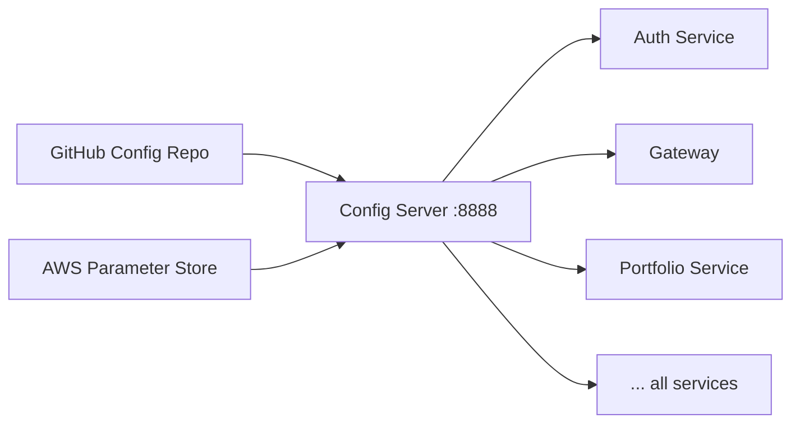

# ⚙️ Switchboard — Config Server

Centralized configuration for all Switchboard services. Serves per-environment YAML from a Git repository, with AWS Parameter Store as a secrets fallback. Every microservice bootstraps from here before starting.

`Java 17` `Spring Boot 3.5.6` `Spring Cloud Config` `AWS SSM` `:8888`

## Architecture



## Key Decisions
| Decision | Choice | Why |
|---|---|---|
| Config source | Git repository | Version-controlled, auditable, branch-per-env |
| Secrets | AWS SSM Parameter Store | Encrypted at rest, IAM-controlled access |
| Bootstrap order | Starts second | All other services depend on it at startup |

## Verify It's Working
```bash
curl http://localhost:8888/AUTHSERVICE/default
```

## Running
```bash
./mvnw spring-boot:run
# Port: 8888
# Env vars: CONFIG_USER_NAME, AWS_ACCESS_KEY_ID, AWS_SECRET_ACCESS_KEY
```

```bash
docker build -t switchboard-config-server .
docker run -p 8888:8888 \
  -e CONFIG_USER_NAME=your-github-username \
  -e AWS_ACCESS_KEY_ID=... \
  -e AWS_SECRET_ACCESS_KEY=... \
  switchboard-config-server
```

> Start this **second**, after service-discovery.
